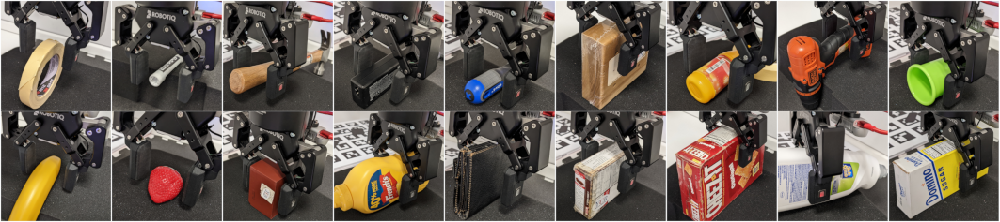

<h1 align="center">
    :wrench: Adaptive Tactile Force Control
</h1>

<p align="center"></p>


<h4 align="center">
  Adaptive Tactile Force Control in a Parallel Gripper with Low Positioning Resolution
</h4>

<div align="center">
  IEEE Robotics and Automation Letters, vol. 8, no. 9, pp. 5544-5551, Sep. 2023
</div>

<div align="center">
  <a href="https://ieeexplore.ieee.org/document/10187696"><b>Paper</b></a> |
  <a href="https://ieeexplore.ieee.org/ielx7/7083369/7339444/10187696/supp1-3297061.mp4?arnumber=10187696"><b>Video</b></a>
</div>

</p>

## Table of Contents

- [Update](#new-updates)
- [Installation](#gear-installation)
- [Citing this paper](#-citing-this-paper)

## :new: Updates

2023-07-20 - Update the `README.md`


## :gear: Installation

### Requirements
- [hsp-panda/xela-server-ros](https://github.com/hsp-panda/xela-server-ros)
- [hsp-panda/panda_moveit_config](https://github.com/hsp-panda/panda_moveit_config)
- [hsp-panda/robotiq](https://github.com/hsp-panda/robotiq)
- [franka-control](#how-to-install-franka-control)
- [simple_pid](#how-to-install-simple-pid)

#### :information_source: How to install franka control
```console
sudo apt install ros-<your_ros_distro>-franka-control
```

#### :information_source: How to install simple pid
```console
pip install simple_pid
```

### How to install
Please clone this repository within a ROS workspace, then build it with:

```console
catkin build
```
:warning: These instructions are at the moment tailored to our robot setup. We are working to separate the actual
algorithm presented in the paper from the implementation of the ROS node.


## 📰 Citing this paper

```bibtex
@ARTICLE{10187696,
  author={Piga, Nicola A. and Natale, Lorenzo},
  journal={IEEE Robotics and Automation Letters}, 
  title={Adaptive Tactile Force Control in a Parallel Gripper With Low Positioning Resolution}, 
  year={2023},
  volume={8},
  number={9},
  pages={5544-5551},
  doi={10.1109/LRA.2023.3297061}}
```

## 🧔 Maintainer

This repository is maintained by:

| | |
|:---:|:---:|
| [](https://github.com/xenvre) | [@xenvre](https://github.com/xenvre) |
